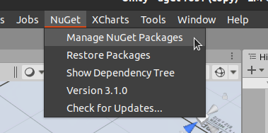
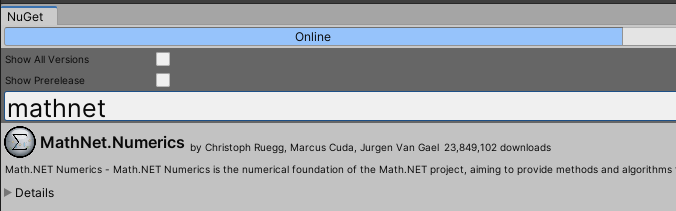
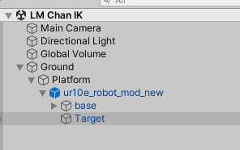

# GEMINISE IK Solver 
This is an Inverse Kinematic solver for robotic arm system in Unity. The algorithm is converted from LM Chan's solution specifically. (See Peter Corke's docs for further details.)

Credit: [Peter Corke's Manipulator Differential Kinematics Tutorials](https://github.com/jhavl/dkt.git)

## Prerequisite

This solver relies heavily on matrix manipulation, so a matrix library for C# needs to be installed beforehand. In this case, we use a Nuget package, [MathNet.Numerics](https://numerics.mathdotnet.com/). To install it, follows the steps:

1. Install [NuGetForUnity](https://github.com/GlitchEnzo/NuGetForUnity.git) package by going to `Package Manager` window and click `Add package from git URL...`
   
    
2. Open Nuget package manager. Find **MathNet.Numerics**, install version 5.0.0
   
   
   

## Example Scene
Open Scene `LM Chan IK`. Move the `Target` GameObject around to see how it is solving for the Robot IK.

*For now this only solve position successfully, rotation however needs more fixing since the IK solve works under Right-hand rule, while Unity is Left-hand*